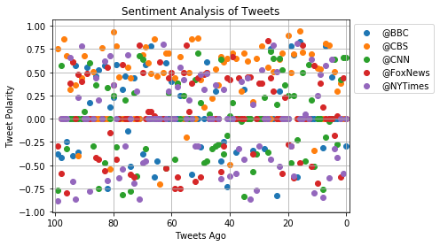

1. Tweets from New York Times appear to be the most neutral as opposed to the other news organisations. 
2. CBS has the highest polarity in tweets and the New York Times has the lowest.
3. Based on the twitter text, BCC has the most retweets.


```python
# import dependencies
import pandas as pd
import numpy as np
import tweepy
import json
import matplotlib.pyplot as plt
import time
from datetime import datetime
import seaborn as sns
from config import consumer, consumer_secret, Access_token, Access_token_secret
from vaderSentiment.vaderSentiment import SentimentIntensityAnalyzer
analyzer = SentimentIntensityAnalyzer()
```


```python
# setup Tweepy API Authentication
auth = tweepy.OAuthHandler(consumer, consumer_secret)
auth.set_access_token(Access_token, Access_token_secret)
api = tweepy.API(auth, parser=tweepy.parsers.JSONParser())
```


```python
# tweets from each news, list for sentiments, counter
sentiments = []
target_users = ("@BBC", "@CBS", "@CNN", "@FoxNews", "@NYTimes")

# loop to look for target users

for user in target_users:
    counter = 0
    
    public_tweets = api.user_timeline(user, count = 100)
    
    # pull all feeds and vader analysis
    for tweet in public_tweets:
        compound = analyzer.polarity_scores(tweet["text"])["compound"]
        pos = analyzer.polarity_scores(tweet["text"])["pos"]
        neu = analyzer.polarity_scores(tweet["text"])["neu"]
        neg = analyzer.polarity_scores(tweet["text"])["neg"]
        tweets_ago = counter
        tweets_text = tweet["text"]
    
        # sentiments
        sentiments.append({"User": user, "Date": tweet["created_at"],"Compound": compound,"Positive": pos,
                           "Negative": neg,"Neutral": neu,"Tweets Ago": counter,"Twitter text" : tweets_text})
        counter = counter + 1
        
```


```python
# dataframe for sentiments
news = pd.DataFrame.from_dict(sentiments)
news.head()
```


<div>
<style scoped>
    .dataframe tbody tr th:only-of-type {
        vertical-align: middle;
    }

    .dataframe tbody tr th {
        vertical-align: top;
    }

    .dataframe thead th {
        text-align: right;
    }
</style>
<table border="1" class="dataframe">
  <thead>
    <tr style="text-align: right;">
      <th></th>
      <th>Compound</th>
      <th>Date</th>
      <th>Negative</th>
      <th>Neutral</th>
      <th>Positive</th>
      <th>Tweets Ago</th>
      <th>Twitter text</th>
      <th>User</th>
    </tr>
  </thead>
  <tbody>
    <tr>
      <th>0</th>
      <td>-0.296</td>
      <td>Thu Mar 29 20:41:00 +0000 2018</td>
      <td>0.099</td>
      <td>0.901</td>
      <td>0.0</td>
      <td>0</td>
      <td>At a time when men thought women shouldn't spe...</td>
      <td>@BBC</td>
    </tr>
    <tr>
      <th>1</th>
      <td>0.000</td>
      <td>Thu Mar 29 18:45:08 +0000 2018</td>
      <td>0.000</td>
      <td>1.000</td>
      <td>0.0</td>
      <td>1</td>
      <td>RT @BBCBreakfast: Counting down the hours unti...</td>
      <td>@BBC</td>
    </tr>
    <tr>
      <th>2</th>
      <td>0.000</td>
      <td>Thu Mar 29 18:44:20 +0000 2018</td>
      <td>0.000</td>
      <td>1.000</td>
      <td>0.0</td>
      <td>2</td>
      <td>RT @bbcrb: Retirement's looking rosy for Hank ...</td>
      <td>@BBC</td>
    </tr>
    <tr>
      <th>3</th>
      <td>0.000</td>
      <td>Thu Mar 29 18:44:11 +0000 2018</td>
      <td>0.000</td>
      <td>1.000</td>
      <td>0.0</td>
      <td>3</td>
      <td>RT @BBCNewsbeat: Anthony Joshua faces Joseph P...</td>
      <td>@BBC</td>
    </tr>
    <tr>
      <th>4</th>
      <td>0.000</td>
      <td>Thu Mar 29 18:43:51 +0000 2018</td>
      <td>0.000</td>
      <td>1.000</td>
      <td>0.0</td>
      <td>4</td>
      <td>RT @BBCOne: Anyone else having a 'chilled one'...</td>
      <td>@BBC</td>
    </tr>
  </tbody>
</table>
</div>


```python
# to csv
news.to_csv("TwitterNews.csv", index=False)
```


```python
# media tweets graph
for user in target_users: # tried a loop since there are multiple variables
    news_df = news.loc[news["User"] == user]
    plt.scatter(news_df["Tweets Ago"], news_df["Compound"], label = user)
    plt.legend(bbox_to_anchor = (1,1)) # new legend placement!
plt.xlim(101, -1)

plt.grid()
plt.title("Sentiment Analysis of Tweets")
plt.ylabel("Tweet Polarity")
plt.xlabel("Tweets Ago")
plt.show()
```





```python
# average sentiment
avg_sent = news.groupby("User")["Compound"].mean()
avg_sent
```


    User
    @BBC        0.033419
    @CBS        0.353884
    @CNN        0.006581
    @FoxNews    0.034290
    @NYTimes   -0.026123
    Name: Compound, dtype: float64


```python
# overall sentiment graph
x = np.arange(len(avg_sent))
plt.bar(x, avg_sent, color = ["b", "g", "r", "c", "y"], alpha = 0.7, align = "edge")
xticks = [value+0.4 for value in x]
plt.xticks(xticks, ["BBC", "CBS", "CNN", "FoxNews", "NYTimes"])
plt.xlabel("News Orgs")
plt.ylabel("Tweet Polarity")
plt.title("Overall sentiment of tweets")
plt.savefig("overalltweets.png")
plt.show()
```


